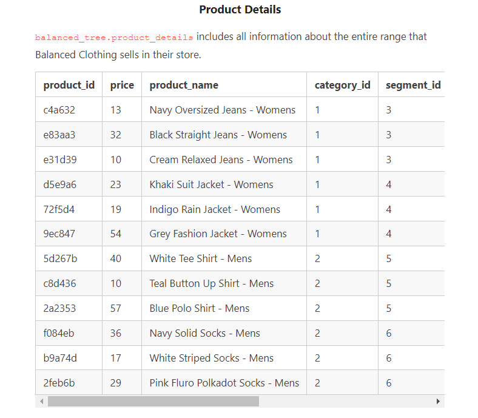
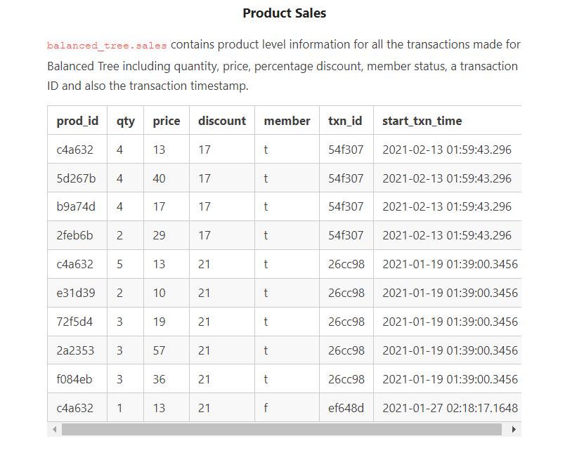
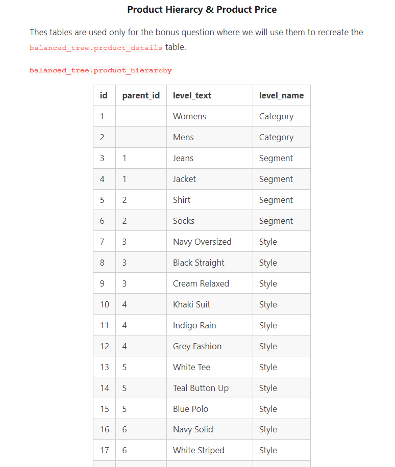
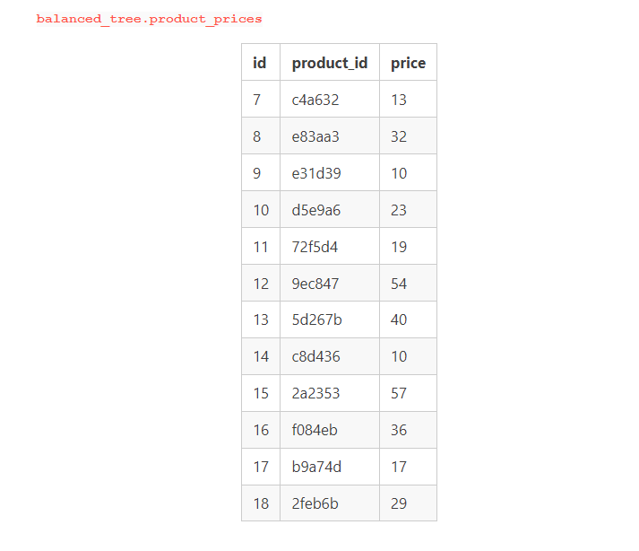

# <p align="center" style="margin-top: 0px;"> Case Study #7 - Balanced Tree Clothing Co.


## <p align="center" style="margin-top: 0px;"> Introduction

Balanced Tree Clothing Company prides themselves on providing an optimised range of clothing and lifestyle wear for the modern adventurer!

Danny, the CEO of this trendy fashion company has asked me to assist the team’s merchandising teams analyse their sales performance and generate a basic financial report to share with the wider business.


## <p align="center" style="margin-top: 0px;"> Available Data

For this case study, there is a total of 4 datasets for this case study - however you will only need to utilise 2 main tables to solve all of the regular questions, and the additional 2 tables are used only for the bonus challenge question!










## <p align="center" style="margin-top: 0px;"> Case Study Questions

The following questions can be considered key business questions and metrics that the Balanced Tree team requires for their monthly reports.

### High-Level Sales Analysis
1.  What was the total quantity sold for all products?
<details>
<summary>Click to show SQL query</summary>
  
```sql
select sum(qty)  as total_quantity_sold
from sales;
```

</details>

#### Output:
total_quantity_sold |
--|
45216|


2.  What is the total generated revenue for all products before discounts?
<details>
<summary>Click to show SQL query</summary>
  
```sql
select sum(qty*price) as gross_revenue
from sales;
```

</details>

#### Output:
gross_revenue|
--|
1289453|

3.  What was the total discount amount for all products?
<details>
<summary>Click to show SQL query</summary>
  
```sql
select round(sum(discount*(qty*price)/100), 2) as total_discount
from sales;
```
</details>

#### Output:
total_discount|
--|
156229.14|

### Transaction Analysis
1.  How many unique transactions were there?
<details>
<summary>Click to show SQL query</summary>
```sql
select count(distinct txn_id) as num_unique_trnsaction
from sales;
```
</details>

#### Output:
num_unique_trnsaction|
--|
2500|

2.  What is the average unique products purchased in each transaction?
<details>
<summary>Click to show SQL query</summary>
```sql
select round(avg(unique_product)) as avg_unique_purchase
from (select txn_id, count(distinct prod_id) as unique_product
		from sales group by txn_id) as uniquiue_txn;
```
</details>

#### Output:
avg_unique_purchase|
--|
6|

3.  What is the average discount value per transaction?
<details>
<summary>Click to show SQL query</summary>
```sql
select round(avg(discount*qty*price/100),2) as avg_discount
from sales;
```
</details>

#### Output:
avg_discount
--|
10.35|

4.  What is the percentage split of all transactions for members vs non-members?
<details>
<summary>Click to show SQL query</summary>
```sql
select round(num_member*100/(num_member + num_non_member)) as percentage_member,
	 round(num_non_member*100/(num_member + num_non_member)) as percentage_non_member
from (select count(distinct txn_id) as num_member
		from sales
		where member = TRUE) as m,
	(select count(distinct txn_id) as num_non_member
		from sales
		where member = FALSE) as nm;
```
</details>

#### Output:
percentage_member | percentage_non_member|
--|--
60 | 40|

5.  What is the average revenue for member transactions and non-member transactions?
<details>
<summary>Click to show SQL query</summary>
```sql
with txn_sales as (select *, (qty*price) as goods_amount, (discount*qty*price/100) as discount_amount
		from sales),
non_member as (select round(avg(goods_amount- discount_amount), 2) as avg_non_member_revenue
		from txn_sales
		where member = FALSE),
members as (select round(avg(goods_amount- discount_amount), 2) as avg_member_revenue
		from txn_sales
		where member = TRUE)
select member_revenue, non_member_revenue
from members, non_member;
```
</details>

#### Output:
avg_member_revenue |  avg_non_member_revenue|
--|--
75.43| 74.54|

###  Product Analysis
1.  What are the top 3 products by total revenue before discount?
2.  What is the total quantity, revenue and discount for each segment?
3.  What is the top-selling product for each segment?
4.  What is the total quantity, revenue and discount for each category?
5.  What is the top-selling product for each category?
6.  What is the percentage split of revenue by product for each segment?
7.  What is the percentage split of revenue by segment for each category?
8.  What is the percentage split of total revenue by category?
9.  What is the total transaction “penetration” for each product? (hint: penetration = number of transactions where at least 1 quantity of a product was purchased divided by the total number of transactions)
10.  What is the most common combination of at least 1 quantity of any 3 products in a 1 single transaction? [Click here to see solution](https://github.com/protechanalysis/Danny-Balance-Tree/blob/main/Product%20Analysis)

### Reporting Challenge
Write a single SQL script that combines all of the previous questions into a scheduled report that the Balanced Tree team can run at the beginning of each month to calculate the previous month’s values.

Imagine that the Chief Financial Officer (which is also Danny) has asked for all of these questions at the end of every month.

He first wants you to generate the data for January only - but then he also wants you to demonstrate that you can easily run the samne analysis for February without many changes (if at all). [Click here to see solution](https://github.com/protechanalysis/Danny-Balance-Tree/blob/main/Reporting%20Challenge%20solution)

### Bonus Challenge
Use a single SQL query to transform the product_hierarchy and product_prices datasets to the product_details table. [Click here to see solution](https://github.com/protechanalysis/Danny-Balance-Tree/blob/main/Bonus%20Challenge%20solution)
